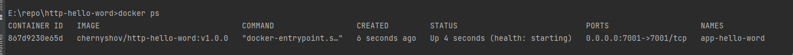
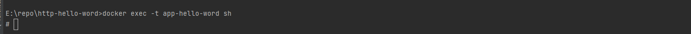
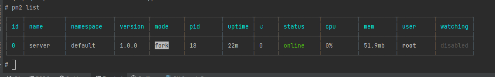
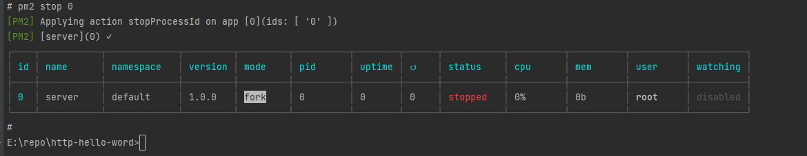
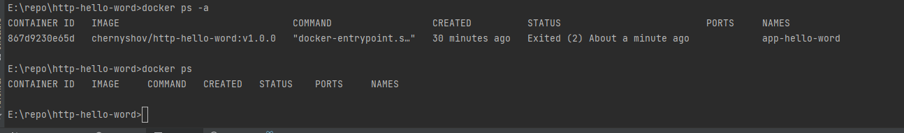
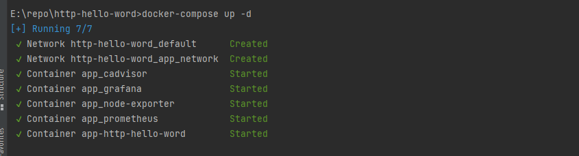
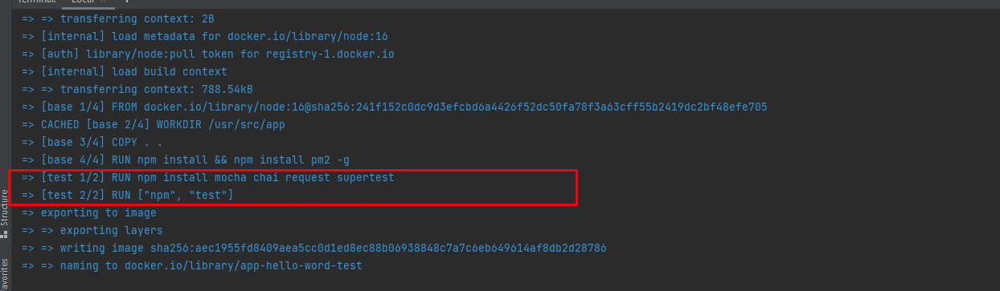
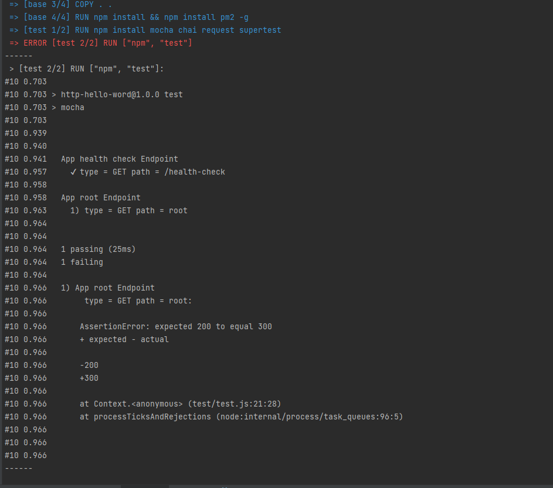

# http-hello-word
Реализовать тривиальное HTTP "Hello, world!" web-приложение на любом
удобном Вам языке программирования и завернуть его в clound native
окружение.

### Требования:
- Dockerfile, который докеризует приложение.
- Приложение должно иметь health-check и ready-check.
- Приложение должно предоставлять metrics endpoint для Prometheus
  (метрики - на Ваше усмотрение).
- Grafana dashboard с визуализацией метрик.
- docker-compose.yml, который запускает приложение со всем необходимым
  окружением (Prometheus и Grafana).
  
### Следующее будет плюсом:
- Kubernetes спеки приложения, либо Helm-чарт, для запуска его в
  Minikube (в дополнение к docker-compose.yaml).
- E2E-тесты, которые проверяют корректность докеризации приложения.

## Решение
### Dockerfile, который докеризует приложение.

Для создания Docker образа можно использовать команду
```
    docker build --target=production -t=chernyshov/http-hello-word:v1.0.0 .
```
Создание контейнера можно использовать команду
```
    docker run -d -p 7001:7001 --name app-hello-word  chernyshov/http-hello-word:v1.0.0
```

### Приложение должно иметь health-check и ready-check.
####health-check
health-check реализовал  в Dockerfile следующим разделом в Dockerfile
```
HEALTHCHECK --interval=10s --timeout=1s --retries=3 --start-period=5s\
  CMD curl -f http://localhost:$port/ || exit 1
```
проверить работу HEALTHCHECK можно следующим образом:

    1. Найти работающий контейнер
```
  docker ps
```


    2. Зайти в контейнер
```
  docker exec -it app-hello-word sh
```


    3. Приложение Node js запущено при помощи сервера приложений PM2.
    Посмотреть приложения запущенные PM2 можно командой
```
  pm2 list
```

    
    Наш сервер запущен с идентификатором 0. 
    Остановить сервер можно командой
```
  pm2 stop 0
```


    Наш процесс остановлен, через несколько секунд контейнер останавливается
  

####ready-check

Не нашел способа реализовать проверку готовности контейнера в Dockerfile или
в docker-compose.

Как я понимаю проверку готовности контейнера к работе можно реализовать в
Kubernetes  при помощи раздела livenessProbe.

Но на текущий момент я не изучал Kubernetes.

### Приложение должно предоставлять metrics endpoint для Prometheus(метрики - на Ваше усмотрение).

Для сбора метрик я использовал два контейнера
  * cadvisor      - собирает информацию о контейнерах
  * node-exporter - собирает информацию о сервере

### Grafana dashboard с визуализацией метрик.

Создал два дашборда
  * container-metrics  - метрики контейнеров
  * node-metrics       - метрики сервера

### docker-compose.yml, который запускает приложение со всем необходимым окружением (Prometheus и Grafana).

  Запустить приложение можно командой
```
  docker-compose up -d
```

###  Kubernetes спеки приложения, либо Helm-чарт, для запуска его в Minikube (в дополнение к docker-compose.yaml).

Но на текущий момент я не работал с Kubernetes.
Мне удалось установить minikube, посмотрю как запускаются приложения в Kubernetes.

###  E2E-тесты, которые проверяют корректность докеризации приложения.

Сделал 2 теста приложения Node js.
Запуск тестирования сборки контейнера можно сделать при помощи команды

```
docker build -t app-hello-word-test --target test .
```


Если сломать тест, то будет такой результат
